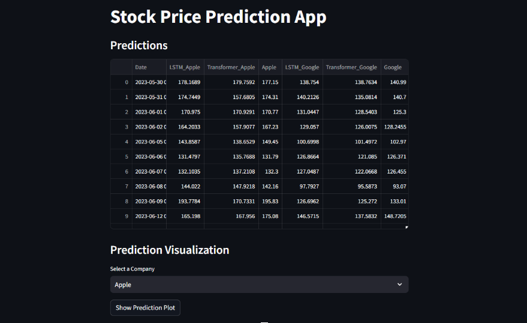

# Comparative Study of LSTM and Transformer Models on Financial Data

This repository contains the implementation of LSTM and Transformer models for the purpose of predicting financial prices. The study encapsulates an extensive analysis of time-series data for stocks, exploring the efficacy of deep learning techniques in forecasting future prices.

## Purpose

The goal of this study is to compare the performance of LSTM (Long Short-Term Memory) networks with Transformer models, which are more recent and have gained popularity due to their self-attention mechanisms. We aim to determine which model better captures the complexities and patterns in financial time-series data for accurate price prediction.

## Experiment

Our experiment involves a detailed comparison across different model architectures, sequence lengths, and amounts of data. The following points outline the key aspects of the experiment:

- Data preparation and preprocessing for LSTM and Transformer models.
- Use of historical stock price data with varying time frames (e.g., 1 year, 3 years, 5 years).
- Evaluation of models based on Mean Squared Error (MSE), Mean Absolute Error (MAE), Mean Absolute Percentage Error (MAPE), and unscaled MAPE.
- Analysis of model performance with respect to different sequence lengths and total amount for the input data (e.g., 7 days, 14 days, 28 days and 1 year, 3 years, 5 years).
- Visualising our model results in a basic Streamlit app. 
The results indicate how the quantity of data and the sequence length impact the accuracy of predictions, providing insights into the temporal dynamics learned by each model.

## Repository Structure

## Setup

## Usage

## Contributions

Contributions to this project are welcome. Please open an issue to discuss proposed changes or submit a pull request.

## License

This project is open-sourced under the MIT License. See the [LICENSE](LICENSE) file for more details.
